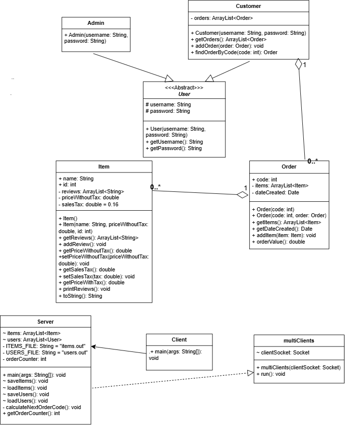

# Multi-Client Ordering System

A multithreaded **client–server ordering system** written in Java using the TCP socket API.
Admins manage a catalogue of items; customers place orders, browse their order history, reorder, and leave reviews on items.

Built as the final project for the *Programming of Networks Protocols* course (Computer Engineering, University of Jordan).

## Features

**Accounts**
- Sign up and log in as either an **Admin** or a **Customer**
- Admin sign-up requires a random verification code generated by the server (printed on the server console, simulating an email/SMS code)
- Duplicate usernames are rejected; failed logins prompt the user to try again

**Admin**
- Add, remove, and modify items (name, ID, price without tax)

**Customer**
- Make a new order by picking items from the catalogue (order value includes 16% sales tax)
- List previous orders (code and date)
- **Reorder**: start from a previous order, then add or remove items
- **Show order details** and add reviews to the items in it

**Server**
- Serves multiple clients at the same time (one thread per client)
- Shared data (item list, user list) is protected with `synchronized` blocks
- Everything is persisted with Java serialization, so data survives a server restart:
  - `items.out` – the item catalogue
  - `users.out` – registered users and each customer's orders
- Unique order codes generated by the server

## Architecture

| Class | Role |
|---|---|
| `Server` | Opens the server socket (port 7733), loads/saves data, accepts connections |
| `multiClients` | `Thread` that handles one connected client (sign-up, login, admin and customer operations) |
| `Client` | Console client: shows menus, sends requests to the server, displays responses |
| `User` (abstract), `Admin`, `Customer` | Account model; a `Customer` keeps its list of `Order`s |
| `Item` | Catalogue item with price, tax, and reviews |
| `Order` | A list of items with a code, creation date, and total value |

Communication: menu choices are sent as integers (`DataOutputStream`), while prompts, credentials, and messages are exchanged as text lines (`PrintWriter` / `BufferedReader`) over the same socket.

The full class diagram is in [`UML.png`](UML.png), and a short write-up is in [`Project_Report.docx`](Project_Report.docx).



## Getting started

**Requirements:** JDK 8 or later.

```bash
git clone https://github.com/omaralnajjar23/multi-client-server-system.git
cd multi-client-server-system

# compile
javac -d out *.java

# terminal 1: start the server
java -cp out Server

# terminal 2 (and 3, 4, ...): start one or more clients
java -cp out Client
```

Notes:
- Run both commands from the project root so `users.out` and `items.out` are created and read there.
- The server listens on port **7733**; the client connects to the local machine (loopback), so run both on the same computer.
- On first start there is no catalogue, so sign up as an **Admin** (the code is printed in the server console) and add some items, then sign up as a **Customer** to place orders.

## Project structure

```
multi-client-server-system/
├── Server.java          # Server, multiClients, User, Admin, Customer
├── Client.java
├── Item.java
├── Order.java
├── UML.png              # class diagram
├── Project_Report.docx  # short project report
├── .gitignore
└── README.md
```

## Limitations

This is a learning project, not production software:
- Passwords are stored in plain text in `users.out`, and traffic is not encrypted.
- The client connects to the loopback address only.
- The data files are Java-serialized objects, so they depend on the exact class definitions.

## Author

Omar Alnajjar
